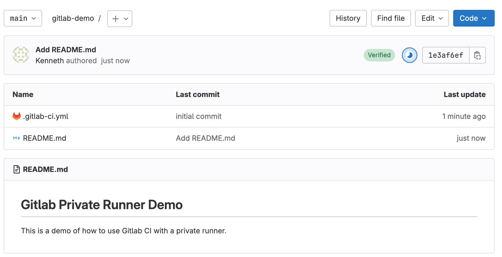
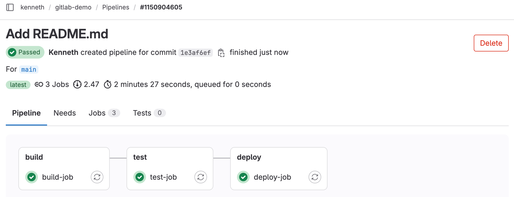
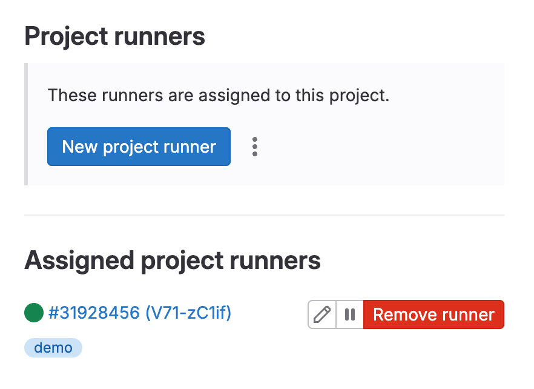
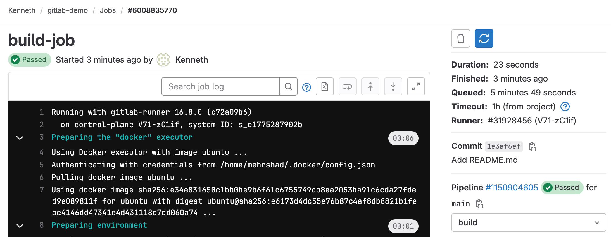

# Private GitLab Runner

## Table of Contents
* [Introduction](#introduction)
* [Create a demo project](#create-a-demo-project)
* [Install Gitlab runner](#Install-GitLab-Runner)
* [Register GitLab runner for the demo project](#register-gitlab-runner-for-the-demo-project)
* [Run CI/CD on the demo project](#run-cicd-on-the-demo-project)
* [Conclusion](#conclusion)

## Introduction
GitLab has a limit on the number of minutes we can use CI/CD runners. 
This is a problem for us because we have projects that consume a lot 
of minutes and we want to run CI/CD on all of them. There are three 
solutions to this problem:
1. [Buy more minutes](https://about.gitlab.com/pricing/)
2. [Create a private runner](https://docs.gitlab.com/runner/install/index.html)
3. [Limit the number of minutes used by a project](https://docs.gitlab.com/ee/ci/pipelines/cicd_minutes.html)

This document describes how we can benefit from private runners. 
For this purpose, we create a demo project on GitLab and setup 
a private runner on a virtual machine. We then use the private
runner to run CI/CD on the demo project.


## Create a demo project
For the demo project, we create an empty repository on GitLab, with 
the following example CI/CD configuration file:
```yaml
build-job:
  stage: build
  script:
    - echo "We are building the app"
    - sleep 10
    - echo "Build is complete"

test-job:
  stage: test
  script:
    - echo "We are testing the app"
    - sleep 20
    - echo "Testing is complete"

deploy-job:
  stage: deploy
  script:
    - echo "We are deploying the app"
    - sleep 30
    - echo "Deployment is complete"
```
The configuration file defines three jobs, each of which sleeps for
a certain amount of time. The purpose of this is to simulate a
real-world scenario where the jobs take a long time to complete.



After creating the project with the above configuration file, we
can see that the CI/CD pipeline has been triggered and is running.



The pipelines consumes about three minutes of CI/CD minutes.


## Install GitLab Runner
We follow the steps in the [GitLab documentation](https://docs.gitlab.com/runner/install/linux-manually.html)
to setup a private runner on a Linux virtual machine. 

First, we install the GitLab Runner package:
```bash
curl -LJO "https://gitlab-runner-downloads.s3.amazonaws.com/latest/deb/gitlab-runner_amd64.deb"
dpkg -i gitlab-runner_amd64.deb
```

After installing the package, we should be able to run the following
command:
```bash
$ gitlab-runner -h
NAME:
   gitlab-runner - a GitLab Runner

USAGE:
   gitlab-runner [global options] command [command options] [arguments...]

VERSION:
   16.8.0 (c72a09b6)

AUTHOR:
   GitLab Inc. <support@gitlab.com>
...
```
The output of the command shows that the GitLab Runner has been
installed successfully. The version of the GitLab Runner 
should be the same as the version of the GitLab server.

## Register GitLab runner for the demo project
We get back to our demo project. From the menu
on the left, we select `Settings` -> `CI/CD` -> `Runners`.

From the Project Runners section, we click
on the `New project runner` button. We 
choose Linux as the Operating System and
add `demo` as Tags.

This will show us the registration token,
as well as the command to register the
runner. We copy the command and run it
on the virtual machine where we installed
the GitLab Runner.

We use Docker as the executor for the 
runner, and choose the `ubuntu:latest`
image.



The GitLab Runner is now registered for the demo project.
It now accepts jobs with tag `demo`. To enable the runner
to run jobs without tags, we go to the `Settings` -> `CI/CD` -> `Runners`
page, and click on the `Edit` button of 
our new GitLab Runner. We then check the 
`Indicates whether this runner can pick jobs without tags` checkbox.

## Run CI/CD on the demo project
In the end, we can re-run our pipeline on the demo project.
This time, the pipeline will be run by our private runner.



## Conclusion

GitLab private runners are useful when we want to run CI/CD on
projects that consume a lot of minutes. We can create a private
runner on a virtual machine and register it for the projects
that we want to run CI/CD on. The private runner will then
run the CI/CD jobs for these projects.